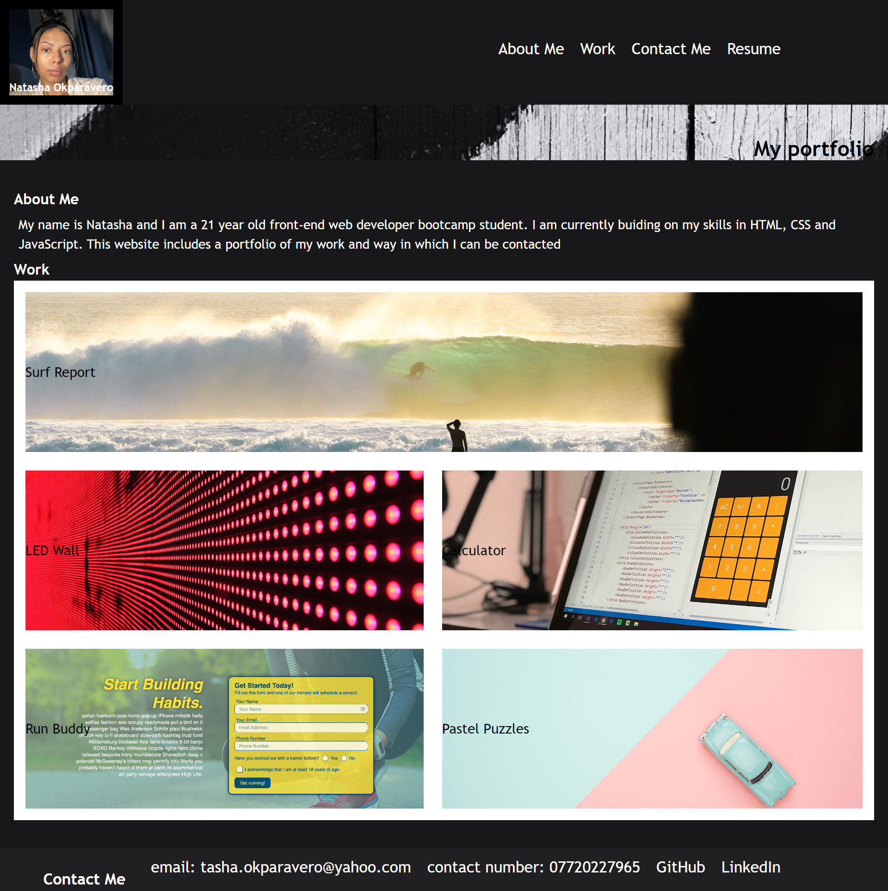

# my-portfolio-2

## Description

This is my portfolio of work, aimed to showcase the skills that I have learn throughout my time in the front-end web developer bootcamp. This porfolio has links that will naviagte you to my deployed web applications, enabling you to review each one.

## Table of contents 
- [screenshot](#screenshot)
- [Installation](#installation)
- [Link to the deployed site](#link-to-the-deployed-site)
- [usage](#usage)
- [credits](#credits)
- [license](#license)

## Screenshot 

## Link to the deployed site 
[my portfolio](https://natasha-16x.github.io/my-portfolio-2/)
## Installation 
N/a

## Usage 
To use my portfolio, you can naviagte to each deployed application by clicking on the place holder image in each section.

## Credits
N/A

## License 
MIT License 